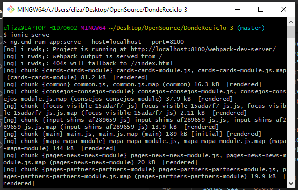

 # Donde Reciclo v3.4
    
## Indice

* [Introducción](#Introducción)
* [Instalación](#Instalación)
* [Uso](#Uso)
* [Datos Abiertos](#Datos)

## Introducción

¿Dónde Reciclo? es una herramienta web y una app para iOS y Android, sirve para encontrar contenedores de residuos reciclables en todo Uruguay y a aprender cómo clasificar mejor en casa.

Esta basada en Ionic5, Angular usando las últimas tecnologías de CSS4 y HTML5 para generar una mejor experiencia de usuario y contenidos exportables a Android e IOS así como las nuevas Web Apps.

Origen

En Uruguay existen muchos esfuerzos destinados a la recuperación de residuos sólidos para su revalorización, tratamiento o disposición final adecuados. Sin embargo la diversidad de programas y el desconocimiento de cada uno de ellos, redunda en que muchas personas crean que en Uruguay no se reciclan ni se recuperan los residuos, o que hacerlo es muy difícil.

Objetivo

 Nuestro objetivo es unificar toda la información sobre todos los lugares, contenedores, dispositivos y programas para recibir residuos o materiales y envases reciclables.

Antecedentes

*  La primera versión de esta herramienta, disponible en la web fue desarrollada y diseñada por [Agustín Kryger](https://twitter.com/agustinkry) y [Agustín Díaz](https://twitter.com/hiroagustin), en coordinación con DATA Uruguay, de forma voluntaria. Utilizando datos de la Intendencia de Montevideo para mostrar en qué lugares se podían depositar pilas, latas, plástico y vidrio.

* En el año 2016, [CEMPRE](https://cempre.org.uy/)  (Compromiso Empresarial Para el Reciclaje)  y [DATA Uruguay](https://data.org.uy/) acordaron trabajar en conjunto para actualizar y ampliar la ambición de dicha herramienta, convirtiéndola además en una aplicación móvil y sumando información sobre clasificación en casa y formas de disposición de residuos.

*  En 2020 se lanza una tercera versión de la herramienta v3.4.0, con más información sobre materiales, mejoras de diseño, interfaz y usabilidad y cambios en el sistema de gestión de la herramienta para permitir enviar reportes sobre contenedores a los distintos programas, así como permitirles a éstos gestionar y actualizar los puntos que se visualizan en la app.

***

## :notebook: Guía de instalación y uso

Son instrucciones que permitira tener una copia de poroyecto funcionando en un ordenador local para desarrollo y pruebas.

### Pre-requisitos: 

#### [Node.js](https://nodejs.org/en/)  >=10.19.0 <=12.15.0

#### [Angular](https://angular.io/) 8.2.14

    npm install -g @angular/cli

#### [Ionic](https://ionicframework.com/) 0.0.0

- **[Ionic](https://ionicframework.com/docs/cli)**

    npm install -g @ionic/cli

### Instalación

- Creación de la carperta donde se quiera guardar el proyecto en tu ordenador (Desktop, Documents,etc).

- Entrar a la carpeta a través de la  consola de comandos.  
    cd Desktop  
    cd Nombre_Carpeta  

- Clonar el proyecto del repositorio.  
    git clone git@github.com:datauy/DondeReciclo-3.git

- Entrar a la carpeta del proyecto final.  
    cd DondeReciclo-3

- Ejecutar comando.  
    npm init

### Ejecución

Para iniciar el proyecto en local es a través del siguiente comando.  
    ionic serve

### Tecnología utilizada

- **[Node](https://nodejs.org/es/docs/)**

- **[Angular](https://angular.io/guide/setup-local)**

- **[Ionic](https://ionicframework.com/docs/cli)**

## Ejemplo de inicio 

## :chart_with_upwards_trend: Datos

##### ¿Qué son los datos abiertos?
Los datos abiertos como aquellos datos digitales que son puestos a disposición con las características técnicas y jurídicas necesarias para que puedan ser usados, reutilizados y redistribuidos libremente por cualquier persona, en cualquier momento y cualquier lugar.
##### Datos abiertos que utiliza la aplicación
Los datos utilizados en esta aplicación se encuentran disponibles para su reutilización a través del [Catálogo Nacional de Datos Abiertos ](https://catalogodatos.gub.uy/).

* [Contenedores para la recepción de residuos reciclables (¿Dónde Reciclo?)](https://catalogodatos.gub.uy/dataset/data-contenedores-para-la-recepcion-de-residuos-reciclables-donde-reciclo)
* [Contenedores de residuos reciclables (plásticos, latas, vidrios y pilas)](https://catalogodatos.gub.uy/dataset/intendencia-montevideo-contenedores_reciclable)
* [Contenedores para clasificación de residuos secos domiciliarios](https://catalogodatos.gub.uy/dataset/intendencia-montevideo-contenedores-residuos-secos-domicialiarios)

<!-- FALTA PROCESO DE DATOS -->
 ## Acerca de DATA Uruguay

 Es una organización de la sociedad civil que busca el fortalecimiento de comunidades y activismo social a traves de herramientas sociales para la participación y el uso de datos abiertos. [Conoce más](https://data.org.uy/)

<!-- ## Bitácora de cambios (changelog) -->

## Contacto
* Consultas sobre el proyecto en general o reciclaje (CEMPRE): 
 cempre@cempre.org.uy

* Consultas sobre la herramienta (DATA Uruguay): 
contacto@data.org.uy

## Autores 
<table>
<tr>
<td>
<a href="https://github.com/fernandouval">
 <b>Fernando Uval</b></a> 
</td>
<td>
<a href="https://github.com/danielcarranza">
 <b>Daniel Carranza</b></a> 
</td>
</tr>
</table>

<!-- ## Incluye v3.4.0

* Menú principal y secundario con navegación móvil y desktop
* Mapa con geolocaliazción y centros de reciclaje
* Rutas a los contenedores próximos
* Busqueda de Materiales reciclables y localización de contenedores
* Compartir en redes sociales
* Fichas de materiales
* Consejos para deposición de materiales
* Programas de reciclaje
* Formulario de contacto
* Creación de usuarios
* Login de usuarios
* Reseteo de contraseña
* Función de reporte de contenedores
* Subir fotos de contenedores
* Editar perfil

## Bitácora de cambios (changelog)
http://soporte.data.org.uy/es/blog/dr-changelog

