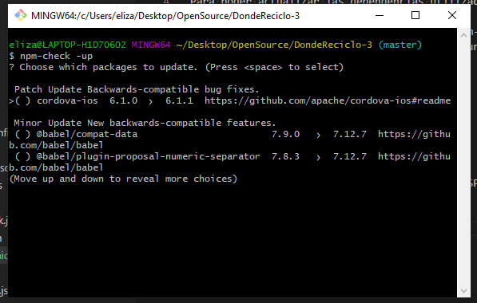

 # Donde Reciclo v3.4

## Actualización de dependencias.

Para poder actualizar las dependencias utilizadas en el proyectos, se requiere una seria de pasos.

- Existe un paquete no oficial llamado <b> npm-check </b> que mejora considerablemente el sistema de actualización de dependencias de NPM, con un sistema interactivo, mucha información bien desglosada y algunos parámetros interesantes

    npm install -g npm-check

- Para porder ejercutarlo es:

    npm-check -u 

- Abre el menú interactivo de actualización. SPACE seleccionas paquetes y ENTER actualiza selección. Como lo siguiente:

